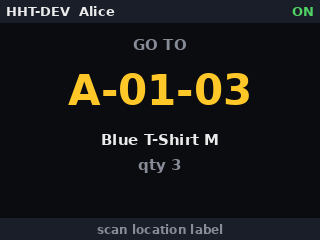
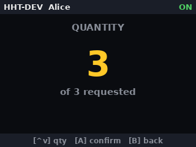

# HandheldPi — DIY warehouse picking terminal

A proof-of-concept hand-held terminal (HHT) for warehouse picking, built from a
Waveshare **GamePi20** (Raspberry Pi Zero 2 W, 2.0" SPI IPS display, gamepad buttons,
battery) and a **Camera Module 3** used as QR/barcode scanner. It talks to a WMS server
over a REST API, guides an operator through pick tasks, and keeps working when the WiFi
doesn't.

The point of the project is not just the gadget: it demonstrates **configuration**
(nothing hardcoded, documented provisioning), **integration** (REST contract, offline
store-and-forward), **testing** (unit + scripted functional tests mapped to a numbered
test specification) and **documentation** discipline for warehouse equipment.

| GO TO location | Quantity | Confirmation |
|---|---|---|
|  |  |  |

*Screens above are real captures from the scripted functional tests (PNG display
backend), not mockups.*

## How a pick works

1. Operator logs in — scans their badge QR (`OP:1001`) or enters a PIN with the D-pad.
2. **A** requests the next task from the WMS: the display shows the location big and
   bright.
3. Operator walks there and scans the location label — a wrong location shows a red
   error and blocks progress.
4. Scans the article (QR or its bare EAN barcode) — wrong article, same treatment.
5. Sets the quantity with ▲/▼ (short picks flagged), confirms with **A**.
6. The confirmation is written to a persistent queue and delivered to the WMS —
   immediately when online, automatically later when not. The operator is never blocked
   by the network.

Short synthesized cues distinguish ready, accepted badge/location/article, rejected
scan, offline transition, and pick confirmation. On the GamePi20 they use the onboard
speaker circuit via PWM audio on GPIO18; audio is asynchronous and fail-open, so a
missing speaker or ALSA device never delays the workflow.

## Hardware

| Part | Notes |
|---|---|
| Waveshare GamePi20 | ST7789V 320x240 SPI display, 12 buttons, battery |
| Raspberry Pi Zero 2 W | 512 MB RAM — dependency budget matters |
| Camera Module 3 (IMX708) | autofocus, needed for 10–20 cm scan distance |
| GamePi20 audio | onboard speaker/headphone amplifier, PWM input on GPIO18 |
| OS | Raspberry Pi OS Lite (bookworm), 64-bit |

Researched pin map, display driver decision (`panel-mipi-dbi`, since fbcp is dead on
modern Raspberry Pi OS) and QR stack choice (picamera2 + pyzbar) are documented in
[PLAN.md](PLAN.md).

## Repository layout

```
config/           example device config + dev config (TOML — the only place settings live)
src/hht/          the application
  state_machine.py  picking workflow (pure logic, fully unit-tested)
  wms/              REST client, mock WMS, persistent offline queue (sqlite)
  ui/               screens (PIL) + framebuffer/console/PNG display backends
  inputs/           GPIO buttons / dev keyboard
  scanner/          picamera2+pyzbar / mock
  audio/            queued ALSA cue player / silent dev backend
  tools/            buttontest (bring-up), logreport (shift log analysis)
tests/            pytest suite + scripted functional tests (tests/scripts/*.txt)
scripts/          install.sh (provisioning), setup_display.sh (ST7789V overlay),
                  setup_audio.sh (PWM audio on GPIO18),
                  setup_splash.sh (boot splash / --diag console)
assets/           plymouth boot-splash theme + generated original sound cues
firmware/         panel init sequence source (compiled to /lib/firmware at install)
systemd/          service unit template
docs/             device configuration procedure, test specification, test report template
API.md            assumed WMS REST contract (to be replaced by the real one)
PLAN.md           research notes + phased implementation plan
```

## Quick start — no hardware needed

The whole terminal runs on any Linux box over SSH: mock WMS, keyboard as gamepad,
screen rendered in the terminal.

```bash
python3 -m venv .venv && .venv/bin/pip install -e .[dev]
.venv/bin/python -m hht -c config/dev.toml
```

Keys: arrows = D-pad · `a`/Enter = A · `b` = B · `x` = X (PIN login) · Tab = status ·
`S` = hold-Start (logout) · **`:` = type a scan payload** (e.g. `:OP:1001`,
`:LOC:A-01-03`) · `q` = quit.

## Install on the device

Full procedure with verification checks:
[docs/DEVICE_CONFIGURATION.md](docs/DEVICE_CONFIGURATION.md). Short version:

```bash
git clone <repo-url> ~/HandheldPi && cd ~/HandheldPi
sudo scripts/install.sh          # apt deps, config, display+camera+audio+splash, service
sudo reboot
scripts/verify_unit.sh           # automated Phase 0 verification — expect all PASS
# button sweep + one test pick per the doc, edit /etc/hht/hht.toml, then:
sudo systemctl enable --now hht  # boots straight into the login screen from now on
```

The app runs as a systemd system service: the terminal is usable from power-on with no
login or user session — SSH is for provisioning and diagnostics only. Everything
device-specific (WMS URL, device ID, pin map, timeouts, debounce, log paths) lives in
`/etc/hht/hht.toml` — see the annotated [config/hht.toml.example](config/hht.toml.example).
Provisioning several units? Golden images, clone hygiene, and zero-touch per-unit
identity are covered in [docs/FLEET_PROVISIONING.md](docs/FLEET_PROVISIONING.md).

## Testing

```bash
.venv/bin/python -m pytest                # unit + functional-script suites (54 tests)
.venv/bin/python -m hht -c config/dev.toml --script tests/scripts/offline_pick.txt
```

Three layers, all traced to the numbered cases in
[docs/TEST_SPECIFICATION.md](docs/TEST_SPECIFICATION.md):

- **Unit tests** for the state machine, offline queue, config and mock WMS.
- **Scripted functional tests** (`tests/scripts/*.txt`): a tiny DSL (`press a`,
  `scan LOC:A-01-03`, `wms offline`, `expect_state CONFIRMED`, `expect_queue 1`) drives
  the real app wiring deterministically — with the PNG display backend every step is
  captured as evidence for the [test report](docs/TEST_REPORT_TEMPLATE.md).
- **Manual device cases** (display bring-up, decode latency, power-loss recovery,
  service autostart) for what only hardware can prove.

Logs are JSON-lines (one event per line: state transitions, scans with latency,
rejections, queue activity, connectivity changes) — `python -m hht.tools.logreport`
summarizes a shift.

## Status

Phase 0 (hardware bring-up) completed on unit HHT-001 on 2026-07-12 — display, all 12
buttons, camera, and boot-to-app service verified on the physical device; in-app QR
decode measured at 73–102 ms (target < 500 ms). The bring-up findings (display driver
chain, SPI mode, camera autodetect) are recorded in [PLAN.md](PLAN.md) and encoded in
the install scripts, so the next unit provisions in minutes
([docs/FLEET_PROVISIONING.md](docs/FLEET_PROVISIONING.md)). Phase 2 (full workflow
against the mock WMS) passes the test suite on-device. Next: Phase 3 against the real
Spring Boot API — the HTTP client is coded against the assumed contract in
[API.md](API.md) until the real spec replaces it.
